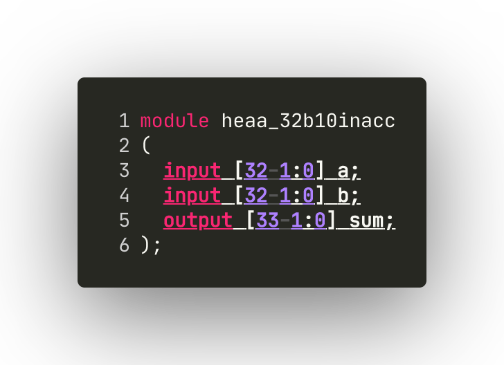
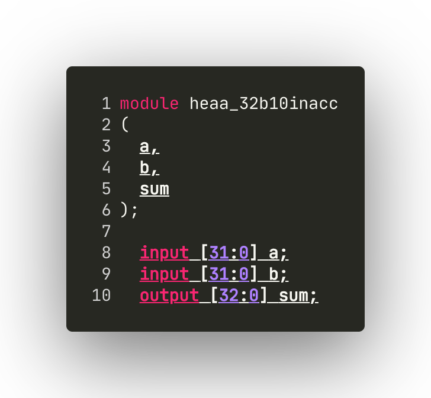
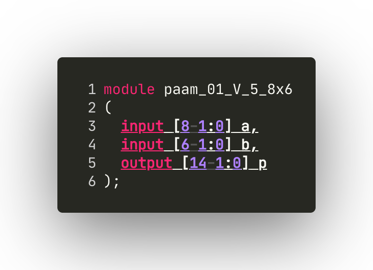
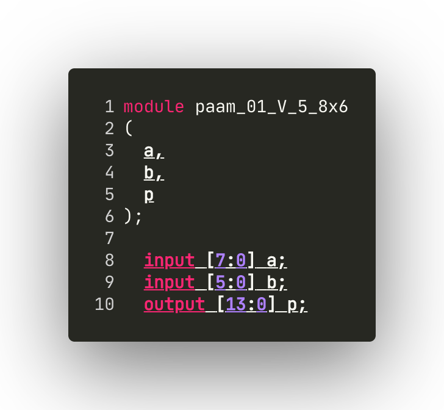
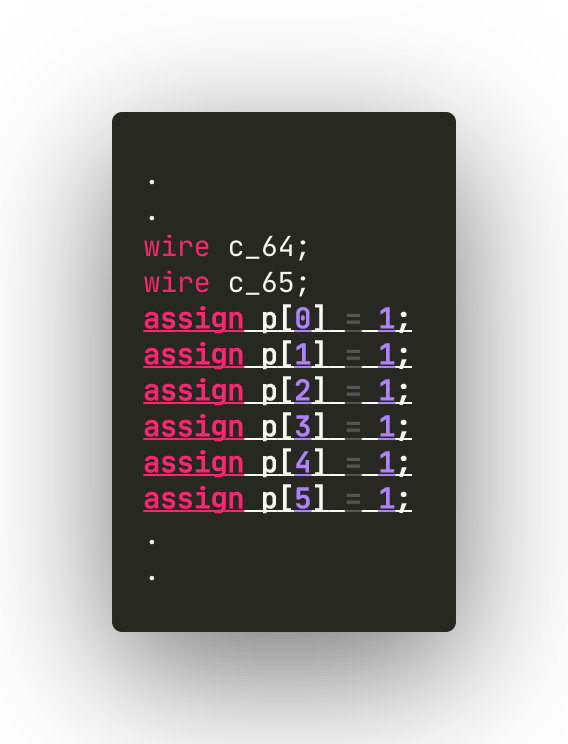
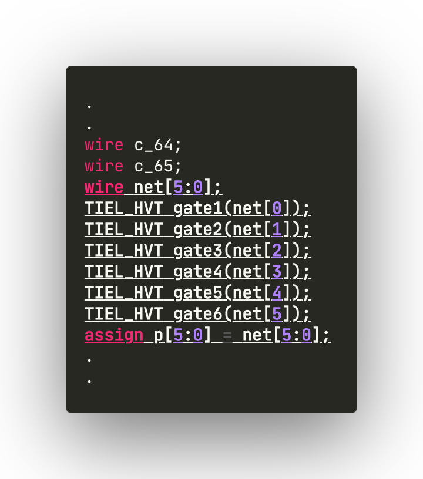

# Editing Generated Verilog Code

## Inaccurate-adder Generated Verilog Code Manual Change

[Adder verilog code generated using the tool](using_gui_tool.md#verilog-code-generator) will look like below (width and size depends upon chosen options)

<!--  -->

```verilog
module hoaaned_32b10inacc
(
  input [32-1:0] a,
  input [32-1:0] b,
  output [33-1:0] sum
);

  wire n1;
  wire n2;
  wire n3;
  wire n4;
  wire n5;
  wire cout12;
  wire cout16;
  wire cout20;
  wire cout24;
  wire cout28;
  assign sum[0] = 1;
  assign sum[1] = 1;
  assign sum[2] = 1;
  assign sum[3] = 1;
  assign sum[4] = 1;
  assign sum[5] = 1;
  assign sum[6] = 1;
  assign sum[7] = 1;
```

you would need to modify the code accordingly to look like the one below

```verilog
module hoaaned_32b10inacc
(
  input [32-1:0] a,
  input [32-1:0] b,
  output [33-1:0] sum
);

  wire n1;
  wire n2;
  wire n3;
  wire n4;
  wire n5;
  wire cout12;
  wire cout16;
  wire cout20;
  wire cout24;
  wire cout28;
  wire net[7:0];
  TIEL_HVT gate1(net[0]);
  TIEL_HVT gate2(net[1]);
  TIEL_HVT gate3(net[2]);
  TIEL_HVT gate4(net[3]);
  TIEL_HVT gate5(net[4]);
  TIEL_HVT gate6(net[5]);
  TIEL_HVT gate7(net[6]);
  TIEL_HVT gate8(net[7]);
  assign sum[7:0] = net[7:0];
```

<!--  -->

## Inaccurate-multiplier Generated Verilog Code Manual Change

For inaccurate-multipliers we have to modify in two places

### 1st modification

[Multiplier verilog code generated using the tool](using_gui_tool.md#verilog-code-generator) will look like below (width and size depends upon chosen options)



modify the <u>underlined</u> code section to look like below



### 2nd modification



modify the <u>underlined</u> code section to look like below


