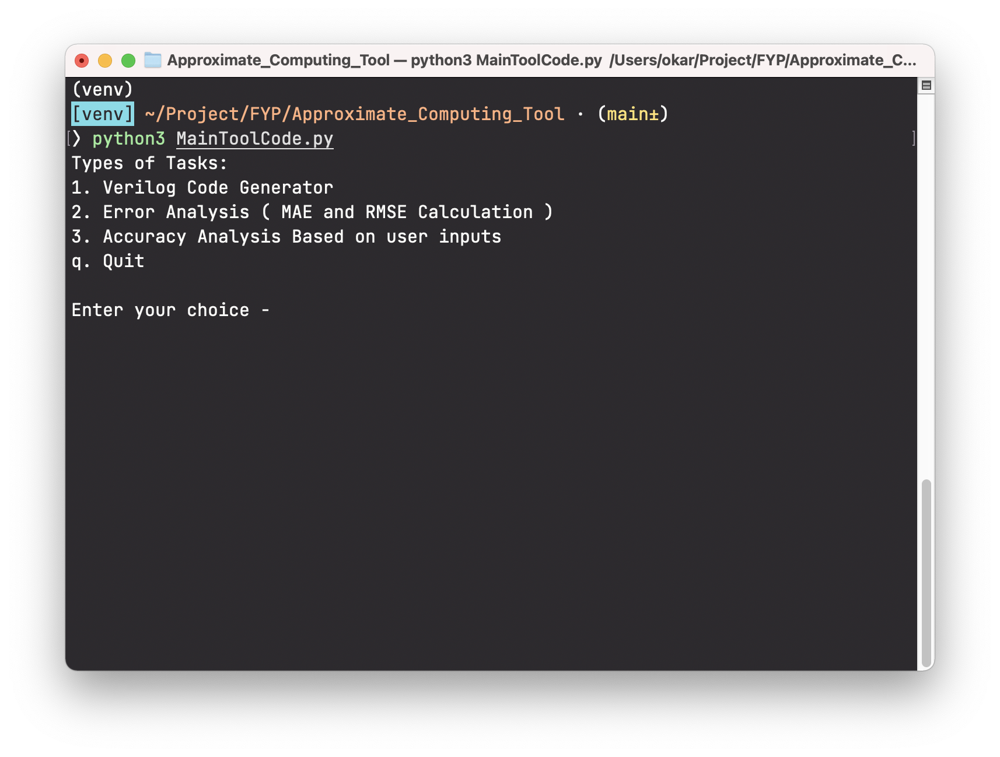
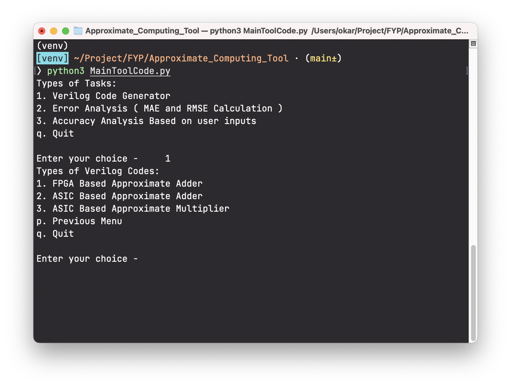
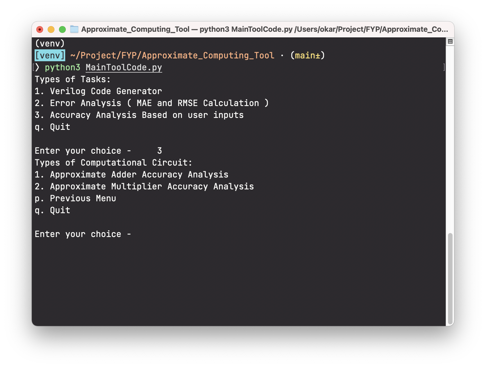

# Using Command Line Tool <!-- {docsify-ignore} -->

!> Before running please check that you have installed required requirements [listed here](/README.md#requirements)

## Steps to run Command Line Tool

1. Clone repository/download the source code from [here](link-to-repository)
2. Extract files if downloaded in zip format
3. Install requirements
4. Run MainToolCode.py

```bash
git clone link-to-repository
cd ApproximateComputingTool
pip install -r requirements.txt
python3 MainToolCode.py
```

?> Command Line Tool and GUI Tool has same constraints and same output results. It is recommended to use [GUI Tool](using_gui_tool.md) whenever possible



## Verilog Code Generator



## Error Analysis


## Accuracy Analysis


