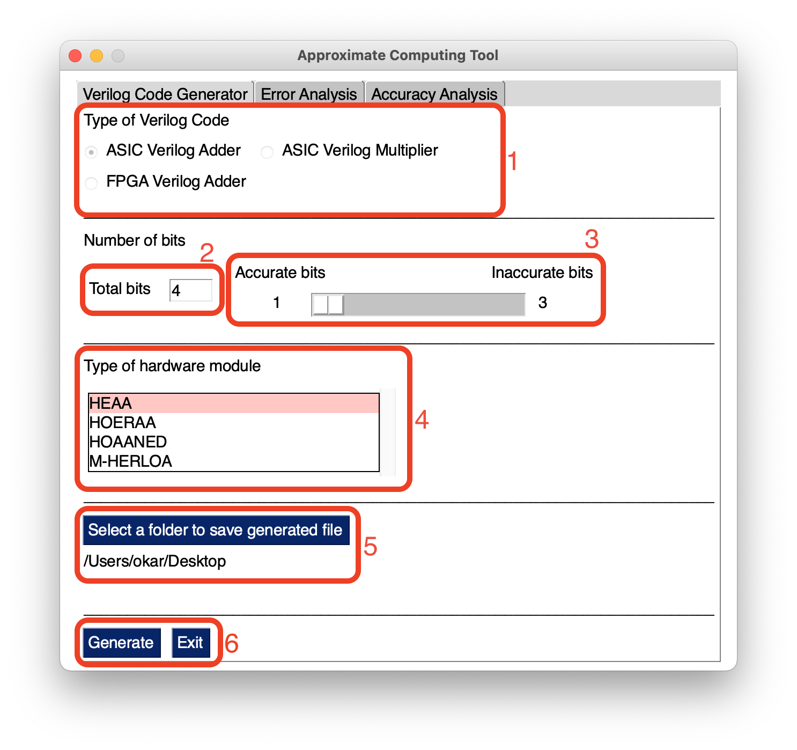
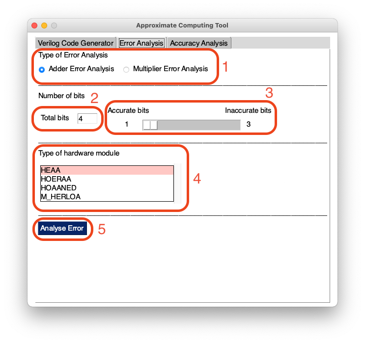
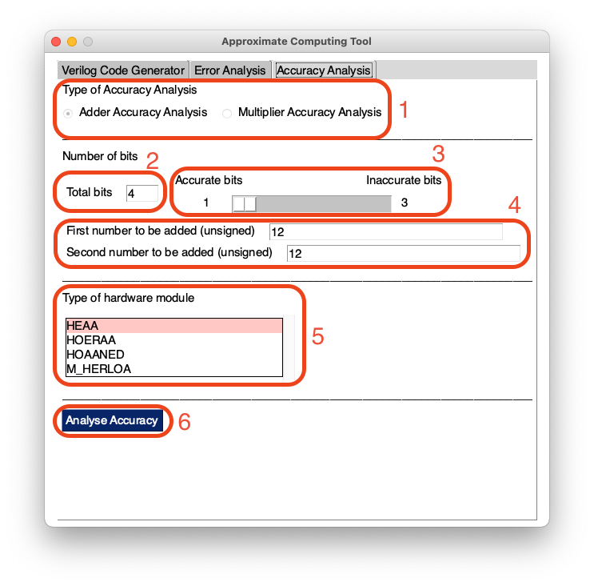

# Using GUI Tool <!-- {docsify-ignore} -->

!> Before running please check that you have installed required requirements [listed here](/README.md#requirements)

## Steps to run the GUI Tool

1. Clone repository/download the source code from [here](link-to-repository)
2. Extract files if downloaded in zip format
3. Install requirements
4. Run GUIMainToolCode.py

```bash
git clone link-to-repository
cd ApproximateComputingTool
pip install -r requirements.txt
python3 GUIMainToolCode.py
```

## Verilog Code Generator

Generate verilog code (.v file) of inaccurate adder or inaccurate multiplier based on user chosen options



### Adder Verilog Code Generator Constraints

| No. | Description                                                                                                             |        Default Option(s)        |            Constraint(s)            |
| :-: | ----------------------------------------------------------------------------------------------------------------------- | :-----------------------------: | :---------------------------------: |
|  1  | Type of Verilog Code to generate, choose one of <br>`[ASIC Verilog Adder, ASIC Verilog Multiplier, FPGA Verilog Adder]` |      `ASIC Verilog Adder`       |                  -                  |
|  2  | Total number of bits for the module verilog code generation                                                             |               `4`               |       `4 <= total_bits <= 32`       |
|  3  | Accurate bits and Inaccurate bits selection. Move slider to adjust.                                                     | `acc_bits = 1` `inacc_bits = 3` | `3 <= inacc_bits <= total_bits - 1` |
|  4  | Type of hardware module to generate, chose one of <br>`[HEAA, HOERAA, HOAANED, M-HERLOA]`                               |             `HEAA`              |                  -                  |
|  5  | Choose location in computer to save generated verilog file                                                              |            `Desktop`            |                  -                  |
|  6  | Generate verilog code or exit                                                                                           |                -                |                  -                  |

### Multiplier Verilog Code Generator Constraints

| No. | Description                                                                                                                                |     Default Option(s)     |           Constraint(s)           |
| :-: | ------------------------------------------------------------------------------------------------------------------------------------------ | :-----------------------: | :-------------------------------: |
|  1  | Multiplicand bits and Multiplier bits                                                                                                      |            `4`            |                                   |
|  2  | V-cut (only for MxN PAAM01 with V-cut)                                                                                                     |            `3`            | `0 <= v_cut <= multiplicand_bits` |
|  3  | Type of hardware module to generate, chose one of `[MxN Accurate Multiplier, MxN Accurate Binary Array Multiplier, MxN PAAM01 with V-cut]` | `MxN Accurate Multiplier` |                 -                 |
|  4  | Choose location in computer to save generated verilog file                                                                                 |         `Desktop`         |                 -                 |
|  5  | Generate verilog code or exit                                                                                                              |             -             |                 -                 |

!> As of 4 Mar 2021 (GMT+8), you will need to modify a tiny portion of generated verilog code. [Click here to find out more](/editing_generated_verilog_code.md). We are working to fix it

## Error Analysis

Analyze error rates of inaccurate adder/inaccurate multiplier by comparing it with accurate adder/accurate multiplier using 1 million monte carlo random sampled unsigned numbers



### Adder Error Analysis Constraints

| No. | Description                                                                                            |        Default Option(s)        |            Constraint(s)            |
| :-: | ------------------------------------------------------------------------------------------------------ | :-----------------------------: | :---------------------------------: |
|  1  | Type of Error Analysis to carry out, choose one of `[Adder Error Analysis, Multiplier Error Analysis]` |     `Adder Error Analysis`      |                  -                  |
|  2  | Total number of bits for approximate computing module                                                  |               `4`               |       `4 <= total_bits <= 32`       |
|  3  | Accurate bits and Inaccurate bits selection. Move slider to adjust.                                    | `acc_bits = 1` `inacc_bits = 3` | `3 <= inacc_bits <= total_bits - 1` |
|  4  | Type of hardware module to analyse error, chose one of `[HEAA, HOERAA, HOAANED, M-HERLOA]`             |             `HEAA`              |                  -                  |
|  5  | Analyse Error                                                                                          |                -                |                  -                  |

### Multiplier Error Analysis Constraints

| No. | Description                                                                 | Default Option(s) |           Constraint(s)           |
| :-: | --------------------------------------------------------------------------- | :---------------: | :-------------------------------: |
|  1  | Total Multiplicand bits and Total Multiplier bits                           |        `4`        |                                   |
|  2  | V-cut                                                                       |        `3`        | `0 <= v_cut <= multiplicand_bits` |
|  3  | Type of hardware module to generate, chose one of `[MxN PAAM01 with V-cut]` |         -         |                 -                 |
|  4  | Choose location in computer to save generated verilog file                  |     `Desktop`     |                 -                 |
|  5  | Analyse Error                                                               |         -         |                 -                 |

## Accuracy Analysis

Analyze accuracy of inaccurate adder/inaccurate multiplier by comparing it with accurate adder/accurate multiplier using two user provided unsigned numbers



### Adder Accuracy Analysis Constraints

| No. | Description                                                                                                            |        Default Option(s)        |               Constraint(s)                |
| :-: | ---------------------------------------------------------------------------------------------------------------------- | :-----------------------------: | :----------------------------------------: |
|  1  | Type of Accuracy Analysis to carry out, choose one of `[Adder Accuracy Analysis, Multiplier Accuracy Analysis]`        |    `Adder Accuracy Analysis`    |                     -                      |
|  2  | Total number of bits for approximate computing module                                                                  |               `4`               |          `4 <= total_bits <= 32`           |
|  3  | Accurate bits and Inaccurate bits selection. Move slider to adjust.                                                    | `acc_bits = 1` `inacc_bits = 3` |    `3 <= inacc_bits <= total_bits - 1`     |
|  4  | Two unsigned decimal numbers to be added using accurate adder and to be compared against inaccurate adder for accuracy |              `12`               | `0 <= decimal_number <= 2^(total_bits) -1` |
|  5  | Type of hardware module to analyse error, chose one of `[HEAA, HOERAA, HOAANED, M-HERLOA]`                             |             `HEAA`              |                     -                      |
|  6  | Analyse Accuracy                                                                                                       |                -                |                     -                      |

### Multiplier Accuracy Analysis Constraints

| No. | Description                                                                                                                     |    Default Option(s)    |                                             Constraint(s)                                             |
| :-: | ------------------------------------------------------------------------------------------------------------------------------- | :---------------------: | :---------------------------------------------------------------------------------------------------: |
|  1  | Total Multiplicand bits and Total Multiplier bits                                                                               |           `4`           |                                                                                                       |
|  2  | V-cut                                                                                                                           |           `3`           |                                   `0 <= v_cut <= multiplicand_bits`                                   |
|  3  | Two unsigned decimal numbers to be multiplied using accurate multiplier and compared against MxN PAAM01 with V-cut for accuracy |          `12`           | `0 <= decimal_number <= 2^(multiplicand_bits) -1` and `0 <= decimal_number <= 2^(multiplier_bits) -1` |
|  4  | Type of hardware module to analyse accuracy                                                                                     | `MxN PAAM01 with V=cut` |                                                   -                                                   |
|  5  | Analyse Accuracy                                                                                                                |            -            |                                                   -                                                   |
